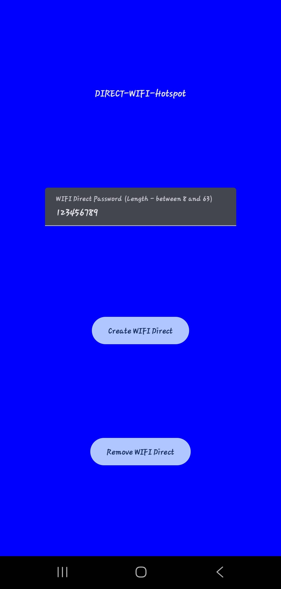

# Wi-Fi Direct Hotspot Android App


A robust, Kotlin-based Android application demonstrating peer-to-peer (P2P) device discovery, connection, and data exchange using the **Wi-Fi Direct** (Wi-Fi P2P) protocol. This project serves as a comprehensive reference implementation for creating ad-hoc networks, enabling device-to-device communication without requiring an intermediate access point or internet connection.

> **Key Concept:** Wi-Fi Direct allows various devices to connect directly with each other. This enables key scenarios like offline file sharing, multiplayer gaming, collaborative tools, and IoT provisioning.

---

## ✨ Features

### Core Capabilities
*   **Device Discovery**: Efficiently scan and list nearby Wi-Fi Direct enabled devices.
*   **Group Management**: Act as a Group Owner (GO) or join existing groups as a client.
*   **Connection Handling**: Robust management of connection states with real-time status updates.
*   **Socket Communication**: Establishes server/client sockets for reliable data transfer after group formation.
*   **Permission Handling**: proper implementation of runtime permissions, including Android 13+ strict requirements (`NEARBY_WIFI_DEVICES`).

### Planned Enhancements
*   [ ] Service Discovery (DNS-SD / Bonjour)
*   [ ] Secure Communication Layer (TLS/Encryption)
*   [ ] Foreground Service support for long-running connections
*   [ ] Modern Material 3 Dark Mode UI

---

## 🏗 Architecture

The functionality is layered to ensure separation of concerns and maintainability:

| Layer | Responsibility |
|-------|----------------|
| **UI** | Activities/Fragments handling user interaction and displaying connection state. |
| **Controller** | Manages `WifiP2pManager` interactions (Discovery, Connect, Teardown). |
| **BroadcastReceiver** | Listens for system intents (`PEERS_CHANGED`, `CONNECTION_CHANGED`). |
| **Data Layer** | Socket management for actual payload transfer between devices. |

---

## 🚀 Getting Started

### Prerequisites
*   **Android Studio**: Giraffe or newer recommended.
*   **JDK**: Compatible with Kotlin 1.9+.
*   **Physical Devices**: Two Android devices are required for testing (Emulators do not support full Wi-Fi P2P functionality).

### Installation

1.  **Clone the repository**
    ```bash
    git clone https://github.com/praveenkarunarathne/WIFI-Direct-Hotspot-Android-App.git
    cd WIFI-Direct-Hotspot-Android-App
    ```

2.  **Open in Android Studio**
    *   Select `File > Open...` and choose the project directory.

3.  **Build and Run**
    *   Sync Gradle files.
    *   Deploy to two physical Android devices.

---

## 📱 Screenshots

<p align="center">
  
  <br>
  <em>Peer Discovery Interface</em>
</p>

---

## 🔐 Permissions

This app adheres to Android's strict privacy and security guidelines.

| Permission | Description |
|------------|-------------|
| `ACCESS_FINE_LOCATION` | Required for peer discovery on older Android versions. |
| `NEARBY_WIFI_DEVICES` | **Android 13+**: Required for finding nearby devices without location. |
| `ACCESS_WIFI_STATE` | To check Wi-Fi status. |
| `CHANGE_WIFI_STATE` | To initialize P2P connections. |
| `INTERNET` | Standard networking permission (often implied, but good practice). |

---

## 🧯 Troubleshooting

| Issue | Potential Solution |
|-------|--------------------|
| **No peers found** | Ensure "Location" and "Wi-Fi" are both enabled on the device. |
| **Connection Stuck** | Try removing the group from Settings > Wi-Fi > Direct or restart Wi-Fi. |
| **Socket Failure** | Verify the Client is connecting to the correct Group Owner IP Address. |

---

## 🤝 Contributing

Contributions are welcome!

1.  **Fork** the project.
2.  Create your Feature Branch (`git checkout -b feature/AmazingFeature`).
3.  **Commit** your changes (`git commit -m 'Add some AmazingFeature'`).
4.  **Push** to the Branch (`git push origin feature/AmazingFeature`).
5.  Open a **Pull Request**.

---

## 📄 License

This project is licensed under the **GNU General Public License v3.0**. See the [LICENSE](LICENSE) file for details.

---

## 🙌 Acknowledgements

*   Android Open Source Project (AOSP) documentation.
*   The open-source community for continuous exploration of Wi-Fi P2P limitations and workarounds.
